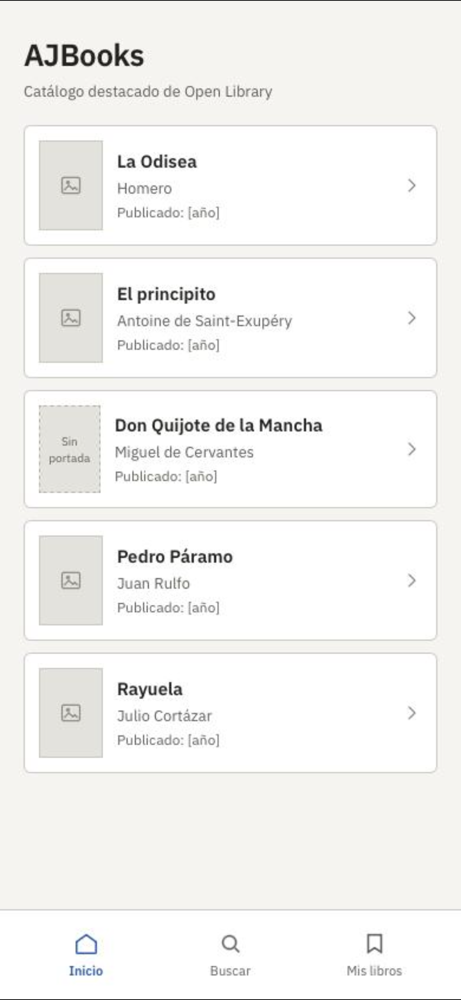
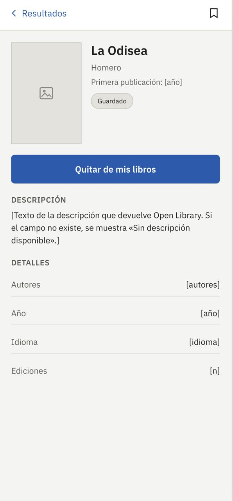
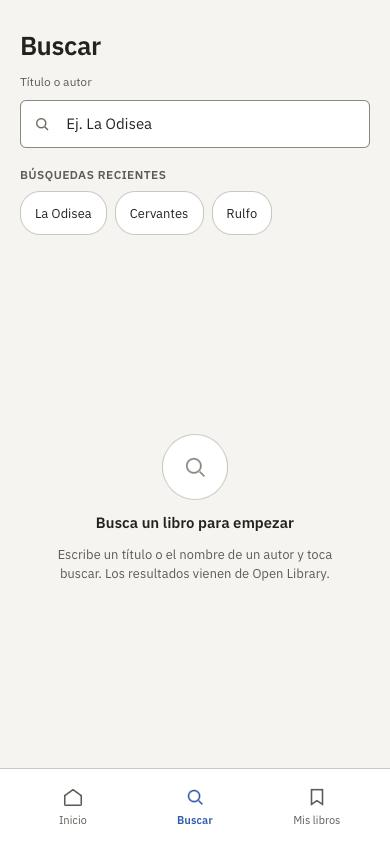
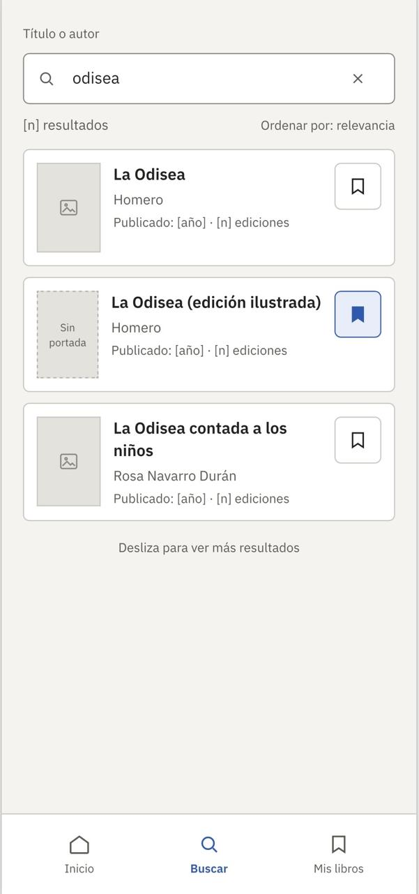
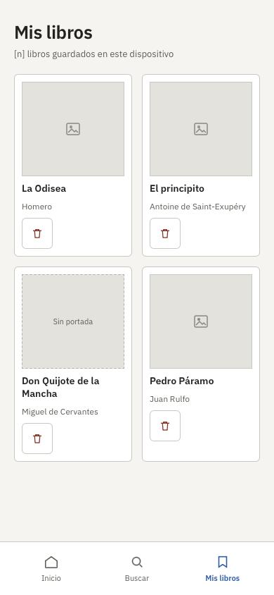

# Proyecto-AJBooKS-Bryan-Yael
Bryan Laurrabaquio Ramírez 
Yael Gonzales
Equipo 8 
AJBooks — Gestor Personal de Libros
Aplicación iOS que permite explorar, buscar y guardar libros usando la API pública de Open Library. Los libros favoritos se guardan localmente en el dispositivo con SwiftData, sin necesidad de crear una cuenta, y siguen disponibles aunque no haya conexión a internet.
Tecnologías
	•	SwiftUI — interfaz
	•	SwiftData — persistencia local de "Mis libros"
	•	Open Library Search API (openlibrary.org/search.json) — búsqueda de libros
	•	Open Library Covers API (covers.openlibrary.org) — portadas
Flujos principales
1. Explorar desde Inicio
Al abrir la app, el usuario ve un catálogo destacado. Al tocar un libro entra al detalle, donde puede consultar su información y guardarlo.
Inicio → Detalle

  
  

2. Buscar y Filtrar
El usuario va a la pestaña Buscar, escribe un título o autor y consulta los resultados que devuelve Open Library. Desde ahí puede abrir el detalle de cualquier resultado y guardarlo.
Buscar → Resultados → Detalle

  
  
  

3. Gestionar Guardados
El usuario va a la pestaña Mis libros para ver todo lo que ha guardado, y puede eliminar cualquier libro directamente desde ahí o desde su pantalla de detalle.
Mis libros → Detalle → Quitar de mis libros

  

Estados de la interfaz
Además del flujo feliz, la app contempla:
	•	Cargando — skeletons mientras responde la API.
	•	Sin resultados — cuando una búsqueda no encuentra coincidencias.
	•	Error de conexión — con botón de reintentar.
	•	Mis libros vacío — cuando aún no se ha guardado ningún libro, con acceso directo a Buscar.
Datos del detalle
Cada libro muestra título, autor(es), año de publicación, descripción, idioma y número de ediciones cuando Open Library los provee. Si algún dato no está disponible (portada, año, descripción), se muestra un estado de reemplazo en vez de dejar el espacio vacío o romper el diseño.
